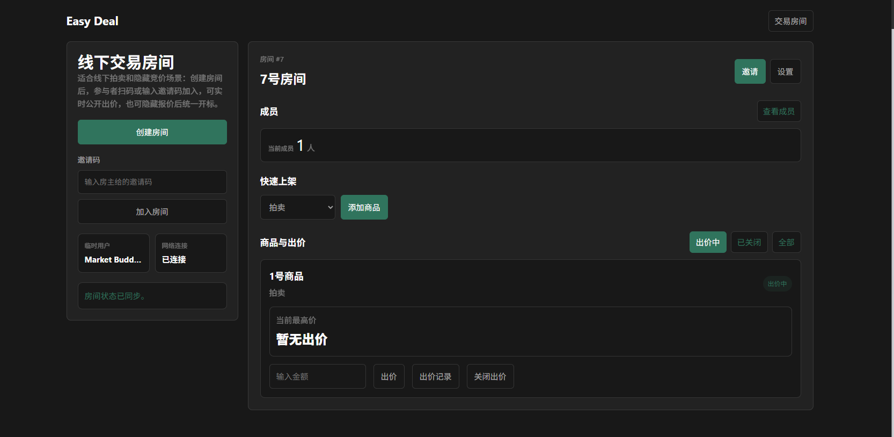

# 简介Introduction
- 为了快速和便捷的进行拍卖和竞标交易,简化了注册流程仅采用临时用户的方式和链接邀请的方式快速创建和加入房间参与竞价.
- 其主要适合小型线下交易会、二手物品竞价、社群内部拍卖、现场隐藏报价收集等场景。
- 特点: 系统使用临时用户身份，参与门槛低，不需要完整账号注册流程。

- To facilitate quick and convenient auction and bidding transactions, the registration process has been simplified, allowing for the rapid creation and joining of rooms for bidding through the use of temporary user accounts and link invitations
- It is primarily suitable for scenarios such as small-scale offline trade fairs, second-hand goods auctions, internal community auctions, and on-site hidden bid collection.
- Features: The system uses a temporary user identity, with low participation threshold, eliminating the need for a full account registration process.

- AI participation 90%

# 界面展示view

